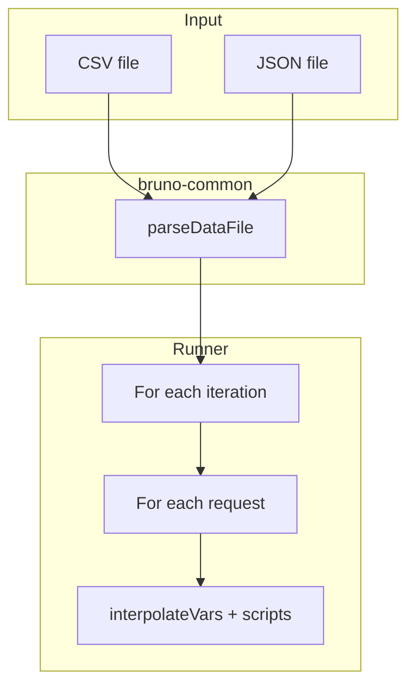

# Runner Data-Driven (Run with Parameters)

> **Status**: Done
> **Created**: 2026-05-17

## 1. Business Context

### Problem Statement

O fork open source do Bruno não oferece **Run with Parameters** (execução data-driven com CSV/JSON). Usuários precisam rodar a mesma coleção com várias linhas de dados (planilha exportada como CSV), sem depender do Bruno Pro.

### Goals

- Permitir rodar coleções com um arquivo CSV ou JSON no app e na CLI.
- Cada linha/objeto do arquivo = uma iteração; variáveis disponíveis via `{{coluna}}` e `bru.runner.iterationData`.
- Paridade funcional mínima com a [documentação oficial](https://docs.usebruno.com/testing/automate-test/data-driven-testing).

### User Stories

#### US-1: Rodar coleção com CSV na CLI

- **Story**: Como desenvolvedor, quero passar `--csv-file-path` ao `bru run`, para executar requests com dados de cada linha.
- **Acceptance Criteria**:
  - **Given** um CSV com cabeçalho `name,job` e 3 linhas, **when** `bru run --csv-file-path dados.csv`, **then** a coleção executa 3 iterações e variáveis `name`/`job` interpolam nos requests.
  - **Given** caminho de arquivo inválido, **when** o comando roda, **then** exit code indica erro de arquivo não encontrado.

#### US-2: Rodar coleção com parâmetros no app

- **Story**: Como usuário do app, quero **Run with Parameters** no modal do runner, para anexar CSV/JSON e executar iterações.
- **Acceptance Criteria**:
  - **Given** uma coleção aberta, **when** abro Run no menu `···`, **then** vejo o botão **Run with Parameters**.
  - **Given** um CSV válido selecionado, **when** confirmo, **then** o runner executa N iterações (N = linhas de dados).

#### US-3: Usar dados da iteração em scripts

- **Story**: Como autor de testes, quero `bru.runner.iterationData.get("col")` e `bru.runner.iterationIndex`, para lógica condicional por linha.
- **Acceptance Criteria**:
  - **Given** iteração 0 com `{ "id": "1" }`, **when** script chama `bru.runner.iterationData.get("id")`, **then** retorna `"1"`.
  - **Given** 5 iterações, **when** script lê `bru.runner.totalIterations`, **then** retorna `5`.

### Key Scenarios

| Scenario | Pre-conditions | Steps | Expected Result |
|---|---|---|---|
| Happy path CSV | Request com `{{email}}`, CSV 2 linhas | `bru run --csv-file-path f.csv` | 2× requests, bodies distintos |
| JSON array | Arquivo `[{...},{...}]` | `bru run --json-file-path f.json` | 2 iterações |
| Arquivo ausente | Path inválido | CLI run | Erro claro, exit ≠ 0 |
| Body sem placeholders | Body estático, CSV 3 linhas | Run com dados | 3 iterações, mesmo body |
| CSV e JSON juntos | Ambos flags | CLI run | Erro: apenas um permitido |

### Functional Requirements

- Parser CSV (cabeçalho + linhas, campos entre aspas) e JSON (array de objetos).
- Interpolação: variáveis de iteração entram no mesmo pipeline de `{{var}}` (precedência: abaixo de `runtimeVariables`, acima de env).
- CLI: `--csv-file-path`, `--json-file-path` (mutuamente exclusivos).
- App: botão **Run with Parameters** + seletor de arquivo no runner.
- Relatório HTML CLI agrupa por `iterationIndex` quando há múltiplas iterações.

### Non-Functional Requirements

- Parser sem dependências externas novas em `bruno-common`.
- Testes unitários para parser e smoke CLI.

### Out of Scope

- Licenciamento / paywall (tudo open no fork).
- Suporte a `.xlsx` nativo.
- `--iteration-count` sem arquivo.
- gRPC/WebSocket no runner com iterações (mantém skip atual).

---

## 2. Arch Decisions

### Proposed Solution

Módulo `parseDataFile` em `@usebruno/common/runner`, consumido por CLI, Electron e App. Loop externo de iterações envolve o loop existente de requests; `iterationVariables` fluem para `interpolateVars` e `Bru.runner`.

### Architecture Overview



### Alternatives Considered

| Alternative | Pros | Cons | Verdict |
|---|---|---|---|
| Parser só na CLI | Menos código | App duplicaria lógica | Rejeitado |
| papaparse | Robusto | Nova dependência | Rejeitado |
| Variáveis só via env-file | Reusa env | UX ruim, N arquivos | Rejeitado |

### Key Decisions

#### Decision 1: Shared parser em bruno-common

- **Status**: Accepted
- **Context**: CLI, Electron e App precisam do mesmo comportamento.
- **Decision**: `parseDataFileFromPath` / `parseDataFileContent` exportados em `@usebruno/common/runner`.
- **Consequences**: Rebuild `bruno-common` após mudanças.

#### Decision 2: Precedência de variáveis

- **Status**: Accepted
- **Decision**: `runtimeVariables` > `iterationVariables` > env/collection/folder/request.
- **Consequences**: Scripts podem sobrescrever linha via `bru.setVar`.

### Implementation Plan

1. `bruno-common`: parser + testes
2. `bruno-js`: `bru.runner.iterationData`, `iterationIndex`, `totalIterations`
3. `bruno-cli`: flags + loop + interpolate
4. `bruno-electron`: IPC + loop + interpolate
5. `bruno-app`: UI Run with Parameters + passar rows ao IPC
6. Testes CLI e unitários

---

## 3. Technical Contract

### Data Models

```typescript
type IterationRow = Record<string, string>;

type ParsedDataFile = {
  rows: IterationRow[];
  sourceType: 'csv' | 'json';
  fileName?: string;
};
```

### Interfaces

**`parseDataFileContent(content: string, type: 'csv' | 'json'): ParsedDataFile`**

- CSV: primeira linha = headers; valores string.
- JSON: `Array<object>` obrigatório; chaves stringificadas nos valores.

**`parseDataFileFromPath(filePath: string): ParsedDataFile`**

- Infere tipo por extensão `.csv` / `.json`; lança se inválido.

**IPC `renderer:run-collection-folder`**

- Novo parâmetro opcional: `iterationRows: IterationRow[] | null`.

**CLI `bru run`**

- `--csv-file-path <path>` | `--json-file-path <path>` (xor).

**`bru.runner` (scripts)**

- `iterationIndex: number` (0-based)
- `totalIterations: number`
- `iterationData.get(key?)`, `.has()`, `.unset()`, `.stringify()`

### Integration Points

- `interpolate-vars.js` (CLI + Electron): spread `iterationVariables` em `combinedVars`.
- `ScriptRuntime` / `TestRuntime` / `AssertRuntime`: passar contexto de iteração ao construir `Bru`.
- Redux `runFolderEvent`: opcional `iteration-started` / `iteration-index` no `runnerResult.info`.

### Invariants & Constraints

- Sem arquivo de dados: comportamento idêntico ao atual (1 iteração implícita).
- `csv-file-path` e `json-file-path` não podem ser usados juntos.
- Arquivo vazio ou sem linhas válidas: erro antes de executar requests.
